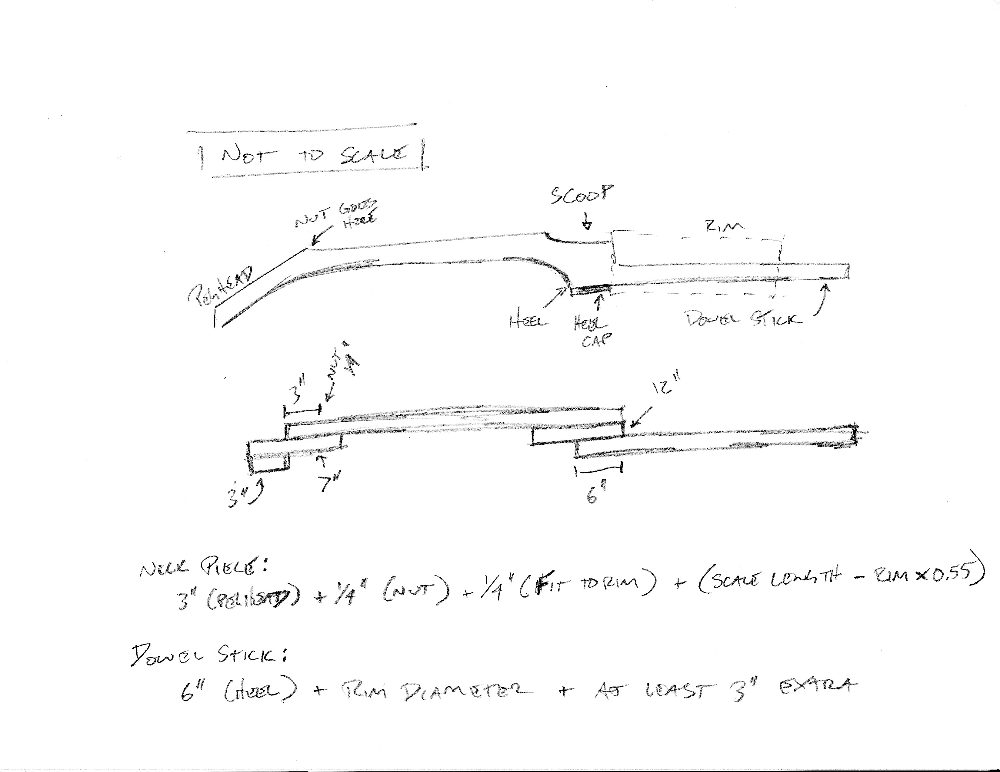
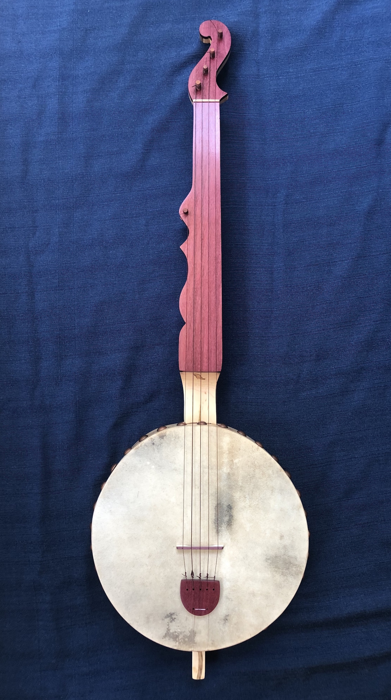

# Building a (fretless, tackhead, block rim) banjo

## Introduction

I prepared this document specifically for two students who are interested in building banjos. If you found your way here, feel free to reach out at [chris.witulski@gmail.com](mailto:chris.witulski@gmail.com) or [my homepage](https://cwitulski.com) with any questions, comments, or (more likely) suggestions. I've built a handful of these and I'm happy with how they came out. I hope that this can be helpful for anyone who is interested in giving banjo building a try.

This process comes out of many late nights of reading the extraordinarily helpful building and repair forums at [banjohangout.com](https://www.banjohangout.org/gotoforum/12). I also drew heavily on other sites that I link to below. The influence of the folks at the BGSU School of Art wood shop who invited me in and taught me the little bit that I know about woodworking, cannot be overstated!

For what it's worth, here are some photos from two recent builds. The first is cherry and ipe and the second is Ambrosia maple and purpleheart. Click for larger images.

    

        
    

    

        
    

    

        
    

    

        
    

    

        
    

    

        
    

## Tools and Materials

I had a few goals in building an instrument when I first did it in 2018.

1. This should be cheaper than buying one.
2. Since people have been building banjos for longer than power tools have been around, I should be able to do it without buying a bunch of stuff.

With that in mind, here is a rough list of necessary tools and materials. I'll give some other useful alternatives below, in case you have access to them.

When I did this the first time, I didn't have much in the way of tools. Just a drill and some similarly basic things. Being cheap, I went to Harbor Freight and bought a handful of things that looked useful. Harbor Freight being what it is, they were hardly useful, but they got the job done. It's been a pleasure replacing those things one by one. This is to say, you can get by with super cheap tools on softer wood. They don't make the work any easier and certainly don't make it any more pleasurable.

I've since learned more about hand tools ([this is a good read](https://lostartpress.com/products/the-anarchists-tool-chest)) and have been replacing things one by one with older tools. These are still pretty cheap and I'm pretty sure I would have started this way had I known about it as an option. [This guy](https://www.hyperkitten.com/HKTC_new/index.php) has some really great stuff and it's worth keeping an eye on his listings. The other advice: don't bother with sets of things. Spend the same amount and get the one that you need, but of a higher quality. Most of these are things that I've since used in everyday life. They're good to have around.

> **Joe and Zachary:** I'll be able to lend you a belt sander, files, rasps, coping saw, peg reamer, and sharpening stone. You can use my radial arm saw for the block rim segments and a hand saw for the string slots. We may try using my router for the rim pieces, if that's the best way to go. This means that you'll need clamps and a drill. I can give you some wax and steel wool. You'll go through enough of the other things that you'll want your own. I also don't have much finish left, otherwise I'd let you borrow it. I can also give you some fishing line.

### Useful power tools

* **Mitre saw, chop saw, or radial arm saw:** This will help you when you're cutting blocks for the rim and for smaller tasks elsewhere.
* **Band saw, circular saw, or panel saw:** You need something to make the big cuts. Access to a band saw is best.
* **Drill:** for starting your peg holes
* **Router:** This can be useful for a fingerboard scoop, but there are other ways to do that, too. I did the scoop on the cherry banjo above with a router (I wanted that flat bottom) and cut out the deep scoop on the other one by hand.
* **Power sander:** I rigged up an old belt sander to work as a bench sander. It made a huge difference and was pretty easy to do. You just need to attach some scrap pieces to a larger board so you can clamp it down. Then I shoved a wedge-shaped piece of scrap into the handle to hold in on. In the future, I'll get a foot pedal. An oscillating sander can help, too, but not until pretty far into the project.

### Hand tools

* **Clamps:** You need so many clamps to glue up the neck. Get a set of at least four bar clamps. The cheapest ones at the store will be fine. They need to be able to screw down tight, so not the "clip" kind, though those are helpful for other things if you have them.
* **Coping saw:** This will help in cutting the peghead and (hopefully) taking the waste out of the inside of the rim rings. I've used a spindle sander for this in the past, but those are not as easy to come by.
* **Hand saw or small files:** These will help in various spots, but especially when it's time to cut string slots in the bridge and nut.
* **Chisel**: Go for one that's at least one that is wide-ish. A half inch or so would probably be most useful. Having two is more useful. My 3/4 has come in handy, but now I have a 1/4 inch one that I thing will also be super useful on future builds, too.
* **Files and rasps:** These make a difference with shaping.
* **Peg reamer:** This is for tapering the holes so that the pegs fit. It's the only banjo-specific tool here and, I can say from experience, that [the one from Stew-Mac](https://www.stewmac.com/luthier-tools-and-supplies/types-of-tools/reamers/peghole-reamers.html) is worth the money when compared to cheap ones on Amazon.
* **Sharpening stone:** You can probably get through a job without this, but it's how you sharpen a chisel and hand plane in the future. There are lots of kinds. They all work. Eventually, if you continue with hand tools, you would want a fine and course grit stone (you can get one with two sides), a leather "strop," and some polishing compound.

### Tools or materials, not sure

* **Eye, ear, and respiratory protection:** Goggles and ear plugs (for power tools) are a must. So are dust masks (like N95s), especially with certain types of woods that can mess with your lungs.
* **Sandpaper:** You'll be sanding forever. Get a box of quality paper in a range of grits up to 400 or so. I've bought the cheap stuff. It doesn't work well.
* **Painter's tape:** This is the blue stuff. You'll be using it to glue up the block rim. The 1 inch thick version is fine.
* **Wood glue:** Titebond is the standard. You'll probably want more than the small bottle. The one that looks like a restaurant ketchup bottle is enough.
* **Finish:** I've used Birchwood Casey's Tru-Oil, which is a gunstock finish. As advertised, it's easy and idiot-proof. It's also tough, which is good for something that you handle (like a banjo or gun stock)
* **Latex gloves:** Get a pack to use for putting the finish on the instrument.
* **Paste wax:** Johnson's Floor Wax does the trick. It just smells terrible for a while.
* **Tack cloth:** This is to apply finish, but you can also use an old t-shirt. Just cut it up into squares.
* **Steel wool:** 0000, which is very fine, will help with the final few bouts of sanding and finishing.

### Materials

* **Wood:** Using two different kinds works well: one for the instrument itself and a second (very hard) wood for things like the fingerboard, peghead, tailpiece, and any contrasting decorations. I'll come back to this below.
* **Skin for the head:** [Elderly Instruments](https://www.elderly.com) sells calf and goat skin heads. Get one that's a good deal bigger than your planned hoop so that you have something to grab on to when gluing and tacking. The thin goat skin has worked well for me. [Jeff Menzies](https://www.facebook.com/jeff.menzies.39) prepares and sells his own down in Jamaica. They're more (usually $50 or so), but they look great. I've heard that they work beautifully, too, but I haven't tried them (yet).
* **Tacks:** Upholstery tacks work well. They should be pretty heavy duty, have broad heads, and look good. Brass looks nice on wood, but that's a taste thing.
* **Pegs:** Violin pegs work well. I've just ordered cheap sets from Amazon. Be sure that they are tapered and not "blanks," though. And remember that you need five, so two sets.
**Strings:** [Aquila Nylgut nylon strings](https://aquilacorde.com/en/shop/modern-instrument-string-sets/timeless-banjo-minstrel-banjo-en/nylgut-banjo-and-minstrel-banjo/) work well for this kind of instrument. I've used the red series, the regular nylon, and the minstrel set. The reds have a texture to them that feels really nice, but it's preference. Using the minstrel set will put your banjo about a fourth below standard tuning.
* **Scrap wood:** You'll need some for the nut (hard maple works well, or you could use scrap from the fingerboard), bridge, tailpiece, and heel cap (if you want one). Fingerboard scraps look good for the tailpiece and heel cap. You could also use them for the nut, if they're good and hard. 1/4" thick would do well. For the bridge, pine works for nylon strings, but maple is more common. It's also common to cap maple with something harder. (Maybe more fingerboard scrap?)
* **Fishing line:** There are a few ways to connect a tail piece to the dowel. Thick (heavy gauge) fishing line is one of them.
* **Gig bag:** Obviously, this is optional, but you can get one for $30 or $40 on Amazon.

### Some optional details

* **Wood or synthetic veneers:** These give that pinstripe look between different types of wood. [LMII sells them.](https://www.lmii.com/148-veneers) Putting them around a "stripe" of the wood you use for a fingerboard gives strength and some good detail. You can see it in the photo below.
* **Stain:** Some people like the look of a stained head. Check out [Romero Banjos](http://www.romerobanjos.com) for some beautiful examples. I used a gel stain from General Finishes when doing this. You can also stain the wood, but that's less common.
* **Brass position markers:** You can see these in the photo of the back of the neck on the cherry banjo here. They are just holes drilled into the neck at various fret locations and filled with small pieces of a brass rod. [OnlineMetals.com](https://www.onlinemetals.com/) sells, well, metals online. They have a warehouse in nearby Toledo (among others) where you can pick up an order. They also ship.
* **Flush frets and frets:** Installing frets involves some extra steps and tools. There are plenty of videos on how to do it, but the main thing is that you need to keep an eye on when you complete each step so that you can ensure parallel lines and even frets. This build is fretless.

## Buying wood

When I was starting with my first build, choosing wood was one of the most mysterious parts. Finish was (and continues to be) another. There are three big questions:

1. What kind of wood do I choose?
2. How much do I need?
3. Where do I get it?
4. How do I cut this wood?

A third one is relevant if you don't have a table saw or band saw in your garage, like me:

Northwest Ohio has a great local place called Laborie Farms in Portage, just outside of Bowling Green. That's the place to go. They also cut wood to size, though it can take a while if they're working with someone to design a kitchen instead of sell $100 worth of scrap for a banjo. So, that's easy. They have local types and a pile of "exotics" that can range from cheap to ridiculously expensive. It's fun to poke around. So that's questions 3 and 4.

### Choosing wood

Best advice here: look at photos from makers. Pick something that you think is attractive and that you've heard of before, at least for the main wood. I loved working with cherry. The ambrosia maple was really interesting: it's maple (super common), but with these stains from insects that lived (past tense) in the tree. Figured and curly maple are gorgeous, but more expensive. I've seen walnut, which is softer (and local to here in Wood County).

Fingerboards need to be hard and smooth. Some of the good choices here can be really expensive, but you're also not looking for much, so it might be worth it. Common ones are ebony (obviously, but not really available and problematic), pau ferro, cocobolo, and figured maple. Others are cheaper, like hard maple, ipe, and rosewood. I've used hard maple (which is boring), ipe (super dark), and purpleheart (which eventually turns dark brown).

There are some cool native options, too. Persimmon and osage orange seem to be popping up more often, for example.

Since the main issue is hardness, it's good to reference a [Janka hardness chart](https://www.bellforestproducts.com/info/janka-hardness/). The higher the number, the harder the wood. It also gets more difficult to work with. You'll see the fingerboard woods in the 2500-3000 range, but hard maple (1450) works just fine for nylon strings, too.

Trim woods can be anything. I like getting extra pieces of the fingerboard wood and using that for consistency, but you can do whatever. Potential spots for trim would be:

* A line down the neck
* The base of the rim
* A heel cap (back of the neck where it flattens and meets the rim)
* The peghead top

I've never done inlays, but I hear that they are not impossible. They just require some extra tools, patience, and creativity. Trim wood could serve as an inlay, or the more common shell (or plastic).

End of the day: choose something that you can find and like. It's nice to look at the piece you're buying, so I've never ordered and shipped anything.

### Wood amounts (a cut list)

You can never have too much scrap, so take these as bare minimums from someone who is cheap and has lucked out by not making enough mistakes to get stuck.

There are two main parts of a banjo to build: the rim and the neck. There are tons of ways to do each, but I've done each two ways. I'll quickly mention one and then go into detail on the other for each part.

#### For the block rim

I've steam bent a rim and done block rims. Steam bending was a pain, but worked. The blocks were more intricate to assemble, but less stressful in one single moment of bending. We're doing a block rim here.

Steam bending involves building a steam box out of PVC, watching it melt, then doing it out of wood, watching it disintegrate, and hoping that you have enough heat to work. You also have to build a form and figure out a contraption to give you leverage. And you need a steamer. It's hard to get a perfect circle, but since you're gluing a head, that's not really much of an issue. Either way, it works, but it's a pain. (I also did it with a quarter inch thick piece of ash instead of the more common laminations, but that's another story. It was old school.)

For the block rim, you get long pieces of wood, cut trapezoids, and assemble an octagon. After a bunch of prep work, you stack them and glue them together to get the proper depth.

To get the size, you need to draw out a circle and work out the geometry. I found a thumbnail image once a while back that gives an idea, though. It's hard to read and the main site isn't there anymore. (If anyone in the internet has info, I'd love to link directly to the creator!)

Taking the larger size rim for the sake of overestimating the amount of wood, you need 8 segments that are each 5 3/16 inches on the outside. Since you flip the wood, it's really 4 times (5 3/16" + *math and stuff*). I'd guess high and call it 5 1/4" times 8 segments for 42" per lamination (per hoop that you'll glue together). If your wood is 1" thick and you want a 3" deep rim, you need three laminations. By the time you cut and sand, it might be short, so guess high. That's four laminations for 168" or 14 feet. The pattern gives a width of 1 11/16". A 2x4 prepped is usually 1 3/4" thick, not 2". So take the 1 11/16" and call it 2".

Some people also use a harder wood for the top of the rim to serve as a wooden tone ring. If you pick something soft, you may want consider that.

That means: 14 feet of wood that's 2 inches wide and 1 inch thick. If you want a cap, you can make that last lamination out of something different, so 3.5 feet of trim an 10.5 feet of the main wood. Always get more.

#### For the neck

I've used two techniques for building a neck. You can see each in the photos at the top of the page. The purpleheart/maple banjo stacks pieces of wood horizontally together. For the cherry/ipe one, I cut a 4x4 in half, folded it on itself (vertically) and put a piece of ipe in between. This second approach gives extra strength because the two long pieces of cherry reinforce each other. Plus, the ipe serves as a super hard bracing (like a truss rod).

I like the second way (the cherry/ipe one), but the first way is far easier. We'll start there. I got the idea from another website (among many) that outlines a banjo building process and also describes all sorts of good woodworking methods, not to mention how to get into and out of problems. [I recommend reading this completely!](https://www.thekimerers.net/brian/minstrel2/)

[This page in particular](https://www.thekimerers.net/brian/minstrel2/neckpieces.shtml) has the layout that we'll use. It comes out to 68" of 1" by 4". Let's call that 6 feet. 7 to be safe. The 4" might really be 3 1/2" after all is said and done.

So, the neck and dowel stick are 7 feet of 1" x 4".

#### For the fingerboard

The fingerboard material is a little different. It should be thinner (1/4" thick works) and it should be about 3 1/2 to 4" wide like the neck wood. It's basically going to lay over the top of the entire next and peghead. If you want a different material for the peghead, go for it. If you want to use figured maple for the neck and skip the fingerboard entirely, go for it.

In any case, you'll want about 24" to allow for extra on the fingerboard, plus 7 or 8 inches to allow for extra on the peghead. You'll also want some scrap for other odds and ends (like the tail piece). This is a gross overestimate: math-wise, if you include a scoop, you can probably get away with 24 inches total. Maybe less. Let's call it 3 feet.

So, the fingerboard material is 2 to 3 feet of 1/4" x 4". It's hard to get 1/4 inch thick stock, so you might buy a 1" thick piece and split it in half on a bandsaw.

#### Totals and board feet

You buy wood in board feet (BF), which is calculated as one inch thick 12x12 pieces. You can look up estimates of prices online, but it varies. I'd check my math if I were you.

Part | Long | Wide | Thick | BF
--- | --- | --- | --- | ---
Rim | 14' | 2" | 1" | 28
Neck | 7' | 4" | 1" | 28
Fingerboard | 2-3' | 4" | 1" | 8-12

## Building the rim

A block rim is basically a stacked set of "laminations." Each of these is an octagon (though you also see 12 or 16 segments). You can mismatch pieces to get a checkerboard pattern or use different woods for different laminations for stripes, rim caps, wooden tone rings, etc. There are a bunch of videos and examples around the internet, this is a distillation that I've used.

### Cutting rim segments (the blocks)

Splitting a circle into segments involves some math for angles. Look back at that layout example above, that's where these numbers below come from. You're dividing 180° by the number of segments. I found it useful to draw up a plan: this is for a 16-segment rim that I hope to do sometime soon. There's a smaller one in there for a banjo ukelele that I want to make for my kiddos. It's hard to read, since I drew this out on brown paper, but it might be worth the time to sketch out what you're looking for, especially if you are not doing an 11- or 12-inch rim. The measurements for those are below.

Segments | Angles | Long side (11") | Long side (12")
--- | --- | --- | ---
8 | 22.5° | 4 3/4" | 5 3/16"
12 | 15° | 3 1/16" | 3 3/8"
16 | 11.25° | 2 9/32" | 2 1/2"

These are the angles for your trapezoids. The lengths are really specific. When all is said and done, it's most important that **the angles are right** and that **the segments are all the same size**. If they are a little bigger or smaller, it just means that your hoop will be a little bigger or smaller. That doesn't matter at all.

The easiest way to cut them is using a chop saw, mitre saw, or radial arm saw. Basically, a tool that makes repeated identical cuts easy. Do this once with a test piece of long scrap, if you have it.

First, set the angle and make one cut to get the end off. Then, you can use the angled side of that end piece as a block so that each other piece is identical in length. Do this by flipping it and clamping it to the saw itself. The piece I cut for this photo was a little short, so I clamped another scrap as a stopper.

From here, you just flip the stock (the long wood you are cutting) to align with your block, slide it down, and make the next cut. Take it off, flip the stock, slide it down, cut.

When you get half of your segments for one of the laminations, lay them out on the floor. They should make a half circle. You can check by lining up a straight edge (a ruler or the long piece of wood that you're cutting). If it's way off, you'll want to adjust the angles and redo them. You can cut these a bit shorter (shave off the angle) and make a smaller rim if necessary. Since you're hopefully working with scrap, that's not a problem. A small half circle will give you the same angles as a large one.

Once you're set, get your regular stock (or put it back on) and keep cutting. If you are doing 3 laminations of 8 segments, you'll need 24 of these segments. Lay out and check your octagons as you go. (This photo shows them glued and taped, which comes next, but you get the idea.)

If they are off by a little, you can shave off the difference in a few ways. One that I remember from the many YouTube videos I watched involved a table saw, where you basically lay out the two half circles and cut their ends flat so that they mate well. Drawing a line with a straight edge and cutting with a hand saw should work, too. Be careful of sanding since you can end up with rounded edges. This would mess with your gluing surface.

### Gluing the laminations

Once the blocks are cut and you know that they fit together well, you can glue them together. One easy way to do this is with blue painters tape.

Lay the blocks for one lamination (one layer) out on a table on their long edge, end to end. This gives you a chance to practice lining them up as closely as possible. Rip off a piece of painters tape that is a few inches longer than the line of blocks. Starting at one edge of the tape, stick the blocks end to end as close as possible. You'll use the few inches of tape to hold the octagon (or whatever) together after gluing.

Practice rolling it up and taping it shut. The blocks should line up *perfectly*. If they are jagged at all, fix it. You can use one edge of the tape as a guide. If any are out of "true" or straight, you'll have to sand the entire layer of rim down to accommodate the gap. It's an easy thing to get just right and it's worth the time.

Once you get them exactly right, you add glue into both sides of each glue surface (where adjacent blocks will touch). Use your finger to spread the glue across the end grain of the wood so that it completely covers both sides of the gap. This may mean you have to lift the blocks a bit by grabbing the tape so that you can get right into the edge of the corner between the trapezoids.

Then, roll it up, use the end of the tape to hold it nice and tight, wipe off any excess glue, and leave it to dry overnight. Do it all again for each layer. If you are going to do a cap on the rim (a layer that's a different material), this is the time to do it. The second picture below is from a time when I wanted to add a layer later on. It turned out to be a tone of awkward extra work since I couldn't get the trapezoids to align exactly correctly.

    

        
    

    

        
    

### Roughing out the laminations

Most rims are around a half inch thick and round, not octagons. It's time to get a rough cut of each lamination so that they are easier to glue together and sand evenly.

Before you can cut, you have to mark. There are plenty of ways to do this, but I found it easiest to simply make a guide out of cardboard (Amazon boxes). Use a compass to cut a circle with your outer diameter and another with the inner diameter. Leave some give, so plan on a 3/4" rim for now. You'll slowly work it down to size after they're glued together. The last thing you want is a dip in one lamination.

The two here are 10 1/2" and 8 3/4", leaving 1 3/4". Remember that this divides in half (there are two widths of rim within the diameter), so they make a 7/8" rim. It's pretty easy to get this down using power sanders, but not so much by hand, so you'll have to balance the reward of starting closer to the target thickness against the risk of ending up things not lining up quite right. Remember, too, that you'll be gluing a skin on, so it doesn't need to align with a standard size measurement.

The easiest way to do this (by far) is to use a spindle sander for the inside and band saw for the outside, but those are expensive. (Lots of videos use a lathe with a giant chuck or big old piece of wood glued to paper to hold it on, though.)

You just run the outside through the bandsaw to get a rough circle, then pop each octagon over the spindle and hog out wood until you have a circle. No worries about cleaning things up yet. That will come after gluing.

I can think of a few ways to do it without those specific power tools. Sawing the angles off until you get close to the outer ring size isn't a big deal. A coping saw should do the trick for the inside. You could also use a hand saw to "kerf" the inside with little cuts right up to the line, then use a chisel to knock out the waste wood.

### Gluing up the rim

Once you have the rough shapes cut, it's time to glue the laminations together. This is pretty straightforward. First, do lots and lots of sanding to make sure that the glue surfaces are clean and even. Then do more. And again. And some more.

Stack the laminations up and think about how you want to align them. If you're doing a fancy checkerboard, this is the time to get it set. You want the segments to overlap in each layer so that they provide extra strength for each other. Go ahead and mark a few lines so that you know where the layers intersect once you put glue on.

Then, spread some glue on each side of the glue surface and set them up. Put the clamps on loosely, to hold, then tighten them little by little, moving around the rim as you do it. Glue slides, so getting one cranked down may mean that you're off a bit and can't move it. Take your time and get them tight. Wipe off the excess as it bleeds out and leave it overnight. (If I knew that I were writing this, I would have taken more pictures of each of these steps!)

### Sanding

Pull out the belt sander, if you have one, and start shaping the rim. You want a nice clean circle. The inside is a pain without a spindle sander, but way-too-much hand sanding will get you there. Start with the coarsest sandpaper and don't step it up until you're pretty much where you want to be. (I go from 80 to 220.) It's definitely worth using a sanding block here: either wrap a piece of sand paper around a scrap piece of wood or glue it right onto a scrap. This keeps your sanding straight and efficient.

Once the walls are even, smooth, and feel really nice, you can think about the top and bottom. The bottom is flat. A few runs on the edges with sandpaper will pull off the sharp edge, but if you're hand sanding, you probably knocked that corner off already.

The top is different. You want a banjo rim to come in contact with the skin evenly and only in one spot. For this reason, you need to be absolutely sure that the top is flat. The easiest way to do this is to put it on a flat surface (a piece of glass is good, but a trustworthy table works, too). If it rocks, you need to sand off the high spots that make it rock.

Then, you only want the rim to hold the skin at it's outermost part. Most banjos use tone rings to do this: a brass hoop or something similar that sits on the rim and holds the skin. We'll do a "wooden tone ring" by angling the top down as you move from the outer to the inner edge.

I've found it to be pretty quick work on my mounted belt sander. You can hold the rim at an angle and just wind it through to "cut" (sand) the bevel. Hand sanding (by finger or with a block) would do the job too. The bevel doesn't matter so much; you're just trying to get the wood out of the way of the skin so that it can ring nicely. Once you're done, run the sand paper over the top a few more times to wear away any sharp points that could tear the skin and flip it upside down again to ensure that it's perfectly flat.

The rim is good for now. We'll come back to it when it's time to cut some holes for the dowel stick, but that's not until after the neck is done.

## Building the neck

Time to build a neck. It's hard to do this first because your scale length (the distance from the nut to the bridge) will depend on the final size of your rim. It's not a like a guitar, where you glue the bridge into place, but you want it to sit roughly 55% of the way down the banjo head. You'll move it around later and, since this is fretless, we have much, much more flexibility than we would have otherwise.

### Measuring the pieces

Now's the time to decide your scale length. It will change the length of the neck. It's usually 26 to 27 inches. If you like your current banjo, go ahead and measure it. We'll use this number to calculate one of our cuts.

I linked to a plan for the neck above. Here's a version with a little bit more detail. Pardon my handwriting: I'll reiterate everything below. This also labels the parts of the neck (peghead, heel, and dowel stick) so that there's no confusion. This is very much not to scale.

The main issue here is that two of the pieces are variable in length. The peghead will tilt back using a pair of smaller pieces (3" and 7"). The extra inch on that middle one allows you to carve out a smoother transition from the back of the peghead to the back of the neck. Some people like a bump there (a hand stop). The same is true for the heel end. The extra width from the 12" piece lets you gradually move into a steeper heel cut.

The piece that connects the bottom of the heel to the dowel stick is easier to calculate than the neck. You need about 6" for the heel (much of this will get cut off) and enough for the dowel stick to go through the rim and come out the other side. You want a few inches on the other side, even after all is said and done. That's how the tail piece will attach to the body. In this drawing, I make this 6" plus 11" for the rim plus 3" to 7" excess. That comes out to 20" to 24".

The neck piece itself involves some more math. The 3" by the head are part of the peghead. Thn you have about 1/4" for the nut. Then, to figure out what's left, you work backward from the scale length: the length of the strings from the nut to the bridge.

As mentioned above, most banjos are 26" or 27" in scale and you want your bridge just past the halfway point of the skin. 55% makes a good guess. So if your rim is 11", just over 6" of your strings will be over the rim (11 x 0.55 = 6.05). That means that 20" of your strings will be over the neck.

This gives us a length of 3" (peghead) + 1/4" (nut) + 20" (scale) + 1/4" (for good measure, since we are carving some of the end out to fit snugly with the rim later). That equals 23 1/2".

Layed out more neatly:

Part | Length
--- | ---
Peghead tip | 3"
Peghead middle | 7"
Neck | 23" to 24": 3" (peghead) + 1/4" (nut) + 1/4" (heel end) + (scale length - rim diameter x 0.55)
Heel middle | 12"
Dowel stick | 20" to 24": 6" + rim diameter + a few extra inches

Here's the wood for two necks, all cut.

One last thing before marking everything up: this is the time to consider how the pieces will look when they are laid out. If you have something with distinctive patterning or grain, like the ambrosia maple in this picture, it's worth taking a moment to look at it and see if there's a way to make it work well for you. As you can see, it's not perfect, but having the grain line up a little bit can make a difference. This is also the time to avoid any knots.

### Gluing the pieces together

Before getting out the glue, be sure that all of the faces sit together perfectly flat. You may need to do some sanding or hand planing depending on the state of the wood. Nylon string banjos don't have a ton of string tension, but you want these glue joints strong.

When you lay them out on a table to check, you can also write numbers and arrows to be sure that you join the right faces together when gluing. This is especially worthwhile if you took the time to line up grain patterns. Just draw lines on the sides and write all over the faces. It'll all get covered in glue (more wood) or cut off.

After "dry fitting" the pieces and rechecking them over and over, get out the glue and as many clamps as you can find. This will take a few days if you don't have way too many clamps lying around. Do a piece or two at a time, crowd the clamps on to get it tight, and let it dry. Take them off, add another piece or two, and do it again. If the pieces don't glue on perfectly straight, it's not a huge deal. You'll be cutting the neck out of this so all the edges will be gone soon anyhow.

### Cutting the peghead profile

The first major cut you'll make is for the face of the peghead. You want a straight line from the middle of the tip up through where the nut will go. This next series of cuts is easiest with a bandsaw, but again, it's very much doable with a handsaw. The goal here is to make sure that when you exit the cut on the face of the neck (where the nut will go), your line goes straight across the neck, perpendicular to the sides. Once you do the face, you can do the back and decide whether you want a hand stop or (as in this drawing), you just curve into the back of the neck.

### Peghead face and fingerboard

I like the look of a peghead top and fingerboard that's about 1/4" thick. This may mean some sanding or hand planing. More importantly, it has to be really really flat. It's a fingerboard, after all. You could put a radius on it (like a guitar), but I don't think that's particularly necessary for a fretless. If the wood is really hard (which it should be), then this could take a while. Clamp it down, dig in, and see you in a few days. For these builds, I used the same piece of wood for both. I like the look of this, because the grain patterns connect across the neck and down the peghead.

The face cut should be perfectly flat. That will mean a bunch of sanding or planing. Again, you want this to glue completely and solidly to the wood for the face. You can worry about the back later. In fact, you may want to wait on cleaning the back up so that you can fix any tear out that happens when you cut out the peghead shape.

Now it's time to cut a piece of your fingerboard material for the peghead face. In this plan, the face is just under 6 1/2". (It's actually 2 * the square root of 10, but who's counting?) When you cut this piece, the end that will face the rest of the fingerboard needs to be angled. I drew the triangle (representing the peghead). The saw needs to be about 18 or 19° off from 90°. This is a mitre saw cut.

Since the rest of the fingerboard is squared off, adjust the saw back to 90°, move about a 1/4" down (to keep the grain in line), and trim off that angle. Then you can cut your fingerboard piece to length. You can go the entire length of the neck or make it a little shorter, if you plan on making a deep scoop. (Shallow scoops that don't go all the way through the fingerboard material are even more common.)

Get the glue and clamps back out, line up the peghead face and glue. Then, use all those clamps again to get the fingerboard. This one is the longest glue job you have, so be careful to space out as many clamps as you can across it. Any gaps will show up when you start cutting the neck into shape.

### Roughing the heel and scoop

With the neck on its side, you can draw the shape that you would like for the heel. The main two options are rounding it over or coming to a sharper point (like a boat). Do an image search online for custom banjos and you'll see a whole host of options. While you're there, take a look at peghead shapes. We'll come back to that. Do the same for the scoop.

For all of these cuts, and many others as we get to the sides, there's a good hand tool technique that uses the kerf of the saw to make life easier. Basically, you cut a whole bunch of lines up to your actual cut line so that you can more easily cut or chisel out the waste. [The site I referenced above has a page with some great pictures of this.](https://www.thekimerers.net/brian/minstrel2/slope.shtml) It's far easier to see than explain. I like a shallower move down the neck with a steeper dip into the heel than in these photos, but I don't have any from this step. I'll have to take some next time.

Repeat this process to cut out the slope of the back of the neck and the scoop.

### Planning the neck

It's time for some of the most interesting design choices: choosing a neck shape and a peghead shape. First, keep poking around internet image searches. Just look at lots of stuff and see what you think.

I already linked to the Romero site, but here's another one that's full of some wild building: [Jeff Menzies Instruments](https://www.facebook.com/menziesinstruments/). His main page seems to be down right now.

While looking, keep an eye out for how the fifth string peg works. Since we're using violin pegs, the side gears are not really an option. I've seen pegs going into the sides, but I think you'd need to cut off the end of your reamer to do that and, well, I'm not willing to.

The [Banjo Database](http://www.banjodatabase.dreamhosters.com/) is another great place to look. These are mostly older minstrel-style banjos. Some of them have tons of pictures and Greg Adams and his team (who started the page) went and visited many of these to take measurements. I used this site extensively when getting started because of how helpful the measurements are.

[Pete Ross's gourd banjos](http://www.banjopete.com/minstrel-era.html) are also a good place to look for some ideas.

The main choice you have is between a straight necked banjo with a lip popping out for the fifth string and a minstrel-style double ogee. This is the set of curves that you see on some of these older ones. (You can also tell that my rim, which was steam bent, is not quite a circle. And it still works.) You can also get creative: I made a last minute decision to turn my last neck into a wide curve that sweeps across the neck where the scoop would go.

    

        
    

    

        
    

The peghead offers a host of other options. Go an image search for "banjo peghead templates" and you'll find some useful charts. After checking out your options by looking at real photos, reverting to these charts will be important for drawing your own on your neck. ([The template chart from Romero](http://www.romerobanjos.com/peghead) is really nice, it shows the shapes alongside real examples and labels each with proper names. If the page moves and breaks this link, the internet image search should still pull similar things up.)

### A note on the double ogee

The winding double ogee edge is worth an extra moment of consideration. This can be purely decorative, but, if you set it up right, the points and bumps serve as markers up the neck.

Here is that same image from above, but with the markers put in. If you wanted to do this, a set of French curves is worth the few dollars that they cost from an art supply or arts and crafts shop.

### Drawing the shape of the neck

There's some math coming up again. The easiest way to check your work on drawing (or shaping) the neck will be returning to a banjo that you like. Measure and copy it.

The center line starts us off. Measure the middle of your neck blank by the nut and the rim end. Draw a line. That's your third string. Easy.

Now you get to think about string spacing. I like a wide spacing and, since these are nylon, they're likely to be for clawhammer or older styles of finger playing. These are not bluegrass banjos. String spacing gets measured at two points: the nut and the bridge. It's common for them to widen very slightly so that left hand fingering is easier and the right hand has more space to maneuver.

Here's the catch: there's no bridge on your neck. It'll be over the rim. Instead of drawing it over the dowel stick and hoping that you are lining things up, you can split the difference and measure at the 12th fret.

So where's the 12th fret? It's halfway down your scale: if you are doing a 26" scale, mark the 12th fret 13" away from the nut. Draw it right on there. You could use the painters tape if it's too dark to see.

While you're at it, mark off the fifth fret, where the fifth string will end. This is a ratio and not just 5/12ths or whatever. Easiest way: find a fret position calculator. [The one from StewMac](https://www.stewmac.com/FretCalculator) is good. Use 24 frets (doesn't matter) and put in your scale length. The instrument doesn't matter, either. Then, find the 5th fret measurement and mark it down. For a 26" scale, it comes out to 6.522". That's close enough to 6 1/2" for us.

I like a 3/8th inch string spacing at the nut and a 7/16ths of space at the bridge, which means that the spacing at the 12th fret is halfway between: 15/32nds. It's basically a pencil mark over the line and mostly relevant for the sides of the neck. The strings will go where we want when we make the bridge.

Mark two strings worth of spacing in each direction at the nut and 12th string, then connect those lines with a straight edge. The fifth string doesn't go all the way up to the nut, so you can stop the line at the 5th fret marker that you put in earlier.

Warning! Make sure you put the fifth string on the right side! It should be on the top when you hold it in your hand. I did this backward once and made a left handed banjo by mistake. I caught it quickly, was able to reglue the pieces, and you could barely tell, but that was boneheaded.

The neck should be about 1/8" wider than the strings, so make some measurements and draw another line just outside of the outer strings.

Lastly, you can draw in whatever you're looking to do for the fifth string and, if you are doing it, the double ogee curves. (You'll need to return to that fret calculator to get the measurements for the double ogee.)

This image shows the stages that I describe above. It's not to scale.

Sit back say, hey! Then hold it and make sure that everything makes sense. It's a big block, but the drawing helps to make it seem a bit more real.

This image shows two necks, one is drawn and I already cut the other. You can see that the edges are really ragged from the first round of cutting. That's fine, they'll get cleaned up later. You're not cutting yet anyhow.

### Drawing and cutting the peghead

The peghead is simpler. Go back to that template you found and pull it up on your computer. Use some image editing software to make it bigger. If you crop it right to the edge of the image, you can use real life measurements in something like Preview on macOS (under "Adjust Size"). You'll want it about 6" tall, but make sure you're measuring the piece of wood so that it's not too big...

Then, print it out and tape it where it goes so that you can trace it. Some people glue it to a piece of cardboard to make it easier to trace.

Make sure that you poke holes in the center of where the pegs go. You need to mark these spots so you can drill the holes. After you take it off, check the spacing of the holes against the size of the heads of your pegs: you don't want the pegs so close together that you can't turn them.

Time to cut. A hand saw will get lots of waste off quickly and a coping saw will cut those corners off. I like to do the peghead first so that the waste is out of the way when it's time to get to the long, straight lines of the neck. At least a little bit out of the way.

Notice how it's clamped up in the photo. You're at a point where you don't want to clamp on to the fingerboard if you don't have to: it could dent it in a way that's a pain to get out later. Same for underneath: there are blocks holding it up so it's steady and the pressure is not on the neck itself. That gets harder to set up as we put a curve in the back.

One other note: you have a choice here about how you cut the peghead. I like the look of lines that are perpendicular to the fingerboard and pegs that are perpendicular to the peghead (see the photos at the top of the page). You can also make the cut for the peghead sides perpendicular to the peghead face. Don't worry if you're off: as long as it holds pegs, it'll do the job.

### Drilling peg holes

The goal here is a straight hole. If it's tilted, then the pegs will be tilted. Not a big deal—they just have to hold the strings—but your eye will see them out of alignment and it might drive you bonkers.

If you don't have a drill press, you can put together a makeshift one with some scrap wood. Use a square (or whatever you have with an angle that you trust) and clamp two pieces into an L shape. This will guide your drill as you make the holes. Even if it's a little off, they'll be off in the same way. That's better than all over the place.

Before drilling, make a starter with a nail or something similar so that your drill doesn't wander. Remember that the peghead/fingerboard wood is hard. And measure your peg shanks so that you know what size drill bit to use. It should be just smaller than the part of the shank that will go through the peghead. You'll widen it out with the reamer later. I've always used 1/4" holes.

### Cutting the neck shape

How you cut the neck will depend on how curvy you made it. If it's straight lines, you can get away with using a circular saw to plow a bunch of wood out on the rough cut. Just keep an eye out, it would be a shame to mess things up now.

A hand saw is far safer for cuts that are long and straight, but there's a lot of wood and maple, for example, is really hard. It's not a fun day. Cut off chunks of waste to make things easier to handle as you make your way through the cut(s).

For curves, you can go back to the coping saw, but it may be too weak to handle the thick stock. You may be better off using the kerfing technique from before. Sawing lines from the side and up to the cut line lets you get the chisel out and work pretty quickly.

Regarding chisels: be careful about the wood grain. If you cut the wrong way, it will break along the grain in a way that you don't want.

You'll end up with some messy lines, but your days of rasping, filing, and sanding will take care of those. These two necks are at different stages of filing.

    

        
    

    

        
    

### Drawing and cutting the dowel stick

You can also see the dowel sticks in that picture above. The dowel stick tapers from the base of the heel through the end. The exact measurement isn't particularly important since you'll be cutting a hole to match whatever you have. Most are about 1" wide at the heel and a 3/4" wide where they exit the rim. Check out the banjo database for measurements on old instruments if you want to get picky.

To get this drawn and cut, you'll first extend your center line all the way to the end of the wood. Mark 1/2" to each side of that line at the heel. Then mark the length of the diameter of the rim (11" or so). Go 3/8" to each side of the center line at that mark. Connect those dots and extend the lines to the end of the wood.

There isn't much reason to cut the end shorter yet, but you're welcome to do so. If you do, be sure to leave 3" or so for the tailpiece. You can shorten it later, once you see it all together. Then cut those lines! It's important to keep these cuts as vertical as possible since they will line up with some holes on the rim later.

### Shaping the back of the neck

In some ways, this can be the most satisfying part of the entire project. You basically chisel, file, and sand until you have a neck shape that feels good in your hand. There's not a ton to say, except that you want to keep an eye on the lines along your fingerboard. Getting into corners is tough, but smaller chisels and files can do it pretty well.

It's another good time to return back to an instrument that you like. Feel the thickness (that's better than measuring, in my experience). Use the coarsest tool for a long time and don't both switching it up until you get close to what you want.  Wear a mask and goggles.

A drawknife is incredible for this job and I've heard that a spokeshave works really well, too. I never had one, but found an old Stanley for $25 or so from [Hyperkitten](https://www.hyperkitten.com/HKTC_new/index.php) and I look forward to trying it on my next build.

An angle grinder with a carving tool or a spindle sander work so well that they feel like cheating.

This is also the time to cut, fit, and glue a keep cap if you are using one. Just cut it out and glue it on. As always, make sure that your glue surfaces are flat and you clamp well. Don't forget to shape and sand your scoop, too.

When you're happy, start sanding with a coarse grit and work your way up to about 220. Keep the mask and goggles on and add an apron. This one's messy.

Here are some shaped necks. Note that the one made out of cherry with a stripe doesn't have a dowel stick. I wanted to try making one after the fact. It's not too bad, but this process here is a little simpler. Also, your pegs won't fit yet. That's coming soon. The last photo here is actually finished and not just shaped, but it gives a good idea of one way to shape the back of a neck with a double ogee on it.

    

        
    

    

        
    

    

        
    

### Fitting the pegs

This is a pretty easy job and it's nice that you can do it inside while watching TV. A peg reamer widens your drill holes with a taper until your pegs fit. It's like a reverse pencil sharpener.

One major tip: you want to be intentional about the peg sizes. You can always widen holes, but you can shrink them. And you want them to be sticking out the same length on the back of the peghead. (You will trim down the shank that goes through the peghead and comes out on the face side.)

You can probably do this easily with calipers, but I made up a jig of sorts. Drill a hole in a piece of scrap from your neck using the same bit you used to make the peg holes in the first place.

Use the reamer to widen this out a bit. You'll be comparing the pegs to each other, so it doesn't matter how wide it is.

Take your eight pegs (remember that you had to buy two sets) and check them over. Sometimes one or two don't look as good as the others, especially if they were cheap. Then put the first one into the reamed hole. Measure how much of the shank sticks out between the block and the peg's head. Write that on a piece of tape and stick it to the peg. Do this for each peg.

Then, you can line up your pegs by this measurement. Assuming that the tapers are all the same (they all fit well in the hole), you will know that the one with the most shank coming out was the one with the widest shank. This is important because you want to work in order.

Now you can go back to the neck. Start with the fifth string hole, since that one is the most precarious (it's on the side of the neck) and you want to keep that hole the smallest. Ream it out until it tapers through the entire hole.

Warning! Remember which way the taper goes! You ream from the back to the front: the peg head goes behind the instrument. You want the strings to go on the front, right?

Take your thinnest peg (the one that had the shortest amount of shank when you measured earlier) and fit it into the hole. You want it to sit so that enough peg comes through the fingerboard that you can get some string on it later. If your pegs have holes drilled into them, ignore them. You'll make your own later.

Then get your next thinnest peg (the next shortest measurement) and pick a hole on the peghead. Do the same thing, but work in order. And be absolutely sure to figure out a way to remember which peg goes to which hole. The main aesthetic thing here is working to get the peg heads to be an even distance from the back of the peghead. Working from thinnest to thickest lets you move to the next thickest one if you overshoot with the reamer.

Finally, mark a spot that's a little bit above where the peg emerges from the fingerboard so that you can saw the ends off and sand them down. You want them to be even. This is also a good time to take a small drill bit and put a new hole in for your strings.

## Assembling the neck and rim

This is a tricky part of the build, but it's also one of the most satisfying to finish up. Once you're done, you'll have two pieces that fit together and look something like a banjo.

### Neck angle

There is a lot of discussion online about banjo neck angles. If you look at old minstrel banjos, there are examples where the neck angle is 0°. Other boards talk about angles that are steeper, around 3°.

These are describing the angle of the neck in reference to the rim. If you lay a banjo (that has no strings or bridge) face down on a table, the neck will usually be tilted back a tiny bit. This adds some downward pressure on the bridge: the neck "pulls" the string backward and into the banjo head.

I have had luck splitting the difference, which accounts for the idea that the angle can help, but you don't need much since we have nylon strings. I aim for 1 to 2° and allow for some wiggle room. You can use the same process, but decide on a different angle if you so desire.

The neck angle is relevant because we need to cut some holes in the rim so that the neck and rim can attach. If we lay both flat and put both holes at the same height on the rim, we'll have a 0° neck angle. If we want the neck to angle away a little bit, the we are going to have to adjust our holes and they won't line up at exactly the same height.

**IMAGE NECK ANGLE**

### Measuring holes in the rim

You need five measurements to cut these rectangular holes:

1. The bottom of the rim to the bottom of the front hole he(by the heel)
2. The bottom of the rim to the bottom of the back hole (by the end of the dowel stick)
3. The hight of the dowel stick, and therefore, the height of the holes
4. The width of the hole at the heel
5. The width of the hole at the end

The distances from the bottom of the rim to the bottom of the two holes are the most difficult to get. There's not a piece of wood to measure. And this also has to account for the neck angle.

This (poorly drawn) diagram shows what you are looking for. Prop the neck up at the angle you want. You have to account for a straight line through the gap that you created when carving out a scoop.

Thinking of a right triangle will help you create that neck angle. If you want 1°, you will have a long side (along the table and under the neck) and a hypotenuse (the neck from the end of the rim to the nut). If the far angle is 1°, you can use an online right triangle calculator to get the height of the neck at the nut.

For our 26" scale neck with an 11" rim, we have 20" of neck. That's the hypotenuse. Our height comes out to about a third of an inch. Let's call it almost 3/8ths (0.375). Use some blocks and a straight edge to set this up. Then you can do some measurements.

You know the height of your rim (if not, just measure it). The difference between the rim height and the height of the dowel stick at the heel. Then measure the diameter of the rim down the length of the dowel on the flat surface of the table (not along the dowel, which is angled).

The height of the dowel stick at each of these points is the distance from the *top* of the rim. Everything is upside down. Subtract that from the height of the rim to get the distance up from the bottom of the rim for the bottom of the two holes.

Be sure to measure straight up from the corner of the imaginary plane extending from the fingerboard and go *straight up*. You are going to cut (carve) this angle out later so that the rim comes in flush with the heel of the neck.

**IMAGE: SET UP TO MEASURE, SHOW OTHER ANGLES**

### Cutting holes in the rim

Once you have the measurement from the bottom of the rim to the bottom of the hole, you can make your square. The height of the square is the thickness of the dowel stick. The width is the width of the dowel stick.

To locate the squares, decide on a front and back of the rim and mark the two points. You may want to hide a nasty patch in the heel of the neck. Always an option.

Cutting the holes is straightforward, but a slow process. Use drill holes to get a bunch of the waste out, then go in with a file to flatten the sides. Start small, check for fit, then get a little bigger. Do it again and again. Remember that the heel sides of each cut will have to be a tiny bit wider than the tail sides since the dowel stick is constantly tapering. Take your time.

These photos show a (somewhat gappy) final product. This is from my first banjo build, which had a steam bent rim.

    

        
    

    

        
    

### Carving the heel

As you start to get closer to the heel, it'll be time to think about carving that angle and curve so that the rim can fit snugly.

This is another job that can be done with any number of tools, but there is no really clean way to go about it. (If you have a separate dowel stick, you can use a spindle sander and do the job quickly.)

File and chisel slowly so that you inch your way toward a snug fit. If you have good control, you may be able to draw in the final cut lines and use the saw kerfing method from the neck, but sharp carving tools are safer.

This is another spot where something pretty is great, but something that fits snugly does the job. This image shows how the curve in the heel matches to the rim, but this particular build didn't have a dowel stick (I added it later). You can also tell that I wasn't quite done with the sanding. Sometimes you need to change up your jobs for the sake of sanity.

### Attaching the rim

The easiest way to attach the rim is with screws. They're a little ugly, but they pull the rim tightly against the neck. An alternative is carving a slot and making a wedge-like "key." These look good, but I haven't tried it myself, yet. You can also drill a hole and use a pin, but that won't pull the pieces closer together. The string tension, should, though, so I imagine a pin would work.

The dangerous part of screws is aiming so that you don't break through the outside of the neck. Depending on how you carved your heel, this may not be possible or may be a tight fit.

Check your screw to get a bit that is the width of the shank and narrower than the thread. This will get you a good pilot hole diameter. Drill your holes so that they angle in toward the center of the neck.

You don't want the screws to grab the rim. The screw head should pull the rim into the neck. Find a larger drill bit, one that is wider than the thread but narrower than the head. Use that to widen the holes in the rim.

Then you can put the screw in and tighten it up. You may need to use a screwdriver instead of a drill here, but in any case, you should be able to get the rim nice and tight against the neck. If not, find the bumps and get the carving tools back out.

Then, you can hold it up and see how it looks and feels like a banjo. That's a good moment. It's also a good time to trim down your dowel stick if you want. Leave a few inches for the loop that attaches your tailpiece.

    

        
    

    

        
    

## Attaching the skin

Every time I have to attach a skin, I go back and read [this page from a minstrel banjo discussion forum](http://minstrelbanjo.ning.com/forum/topics/tack-head-installation?page=1&commentId=2477478%3AComment%3A121817&x=1#2477478Comment121817). I actually copied it into a note on my computer and pull it up. Thanks, Bell Banjos, whoever you are.

Just in case that page disappears into the ether at some point, here's the basic gist.

### Preparing the rim

Figure out where to put the tacks. You'll want a little space between the top edge and the end of the tack, but you don't need much. Then, you want a roughly equal amount of space between the bottom of the tack head and the end of the skin, where you'll cut the skin off and where the finish begins. Take a look at this photo from my first build to get an idea of what I'm talking about.

The best way to figure this out is to simply measure the heads of your tacks and add a bit. This line (head + change) is also going to be the glue line. If you have a marking gauge, you can use that to draw a line around the top of the head, but it's not necessary. Just mark the distance in a few spots around the rim and run a piece of blue painters tape from spot to spot. You'll want to tape off the rest of the rim, too (from that line all the way down to the bottom).

Figure out where you want your tacks (how widely you want to space them) and mark the spots with dark, vertical lines on the tape. A Sharpie works well. These will help you to quickly find the hole, which is important.

Decide on a vertical placement (the halfway point makes sense) and mark the spot for each tack on the wood in pencil. Drill pilot holes with a drill bit that is just barely thinner than the shank of your tacks. Then mark each hole with a dot from the Sharpie. This dot will make it far easier to see the holes when fighting the tacks and it will be covered by the heads of the tacks themselves.

Grab a piece of scrap wood to use to push the tacks in and a friend to help hold everything down.

### Gluing, tacking, and drying

You have to move fast for this part, so read first, then go back to it.

Fill a tub with some water and put the skin in it. You may need to weigh it down with a few things. Meanwhile, put glue on the bare wood of the rim. Try not to get any over the edge. Wait for 30 minutes. The glue will get close to drying and the skin will loosen up in the tub.

Dry the skin off by rolling it in a towel and move quickly to center it over the rim. Don't put it down on the rim until you have it centered. Four hands make this easy. You don't want to move it around and get glue where it shouldn't be.

Get a few tacks ready and have a block to help pushing in tacks handy. You'll put in three next to each other (just one will probably rip the skin when you pull against it). Then, pull the other side as hard as you can and put another three in over there. Three more on each side, again as tight as possible, and you'll be on your way. Move quickly.

Throughout this, be sure not to touch the skin that's stretched over the rim. Keep pulling hard and adding tacks to work your way around the rim. Focus on spots where there are wrinkles so that you can flatten things out as much as possible.

Once everything is in, use a razor blade or scissors to cut off most of the excess. I find it easiest to do this in two stages. First, cut pretty close to the glue line with scissors, then, after working to dry and flatten the skin on the side. Then I go back with a razor blade to clean it up.

For that in-between phase, sit and watch some TV while turning the rim around in your hands and pushing the spaces between the tacks as flat as possible. Keep going around until the skin dries tight. This will be easier if you cut the excess pretty close to the glue line. Then, clean it up with a razor blade.

Wait a day or so before touching the skin. It's great to hear the high pitched ring, but don't touch it until a day or two pass. The link that I shared above mentions rubbing some mink oil in after a few days pass. I haven't had any, so I can't speak to this, but there's no reason to believe that it wouldn't help!

## Other pieces

The last step for the banjo itself is the finish, but the tail piece needs finish, too. So this section has a few comments about building the other odds and ends that you'll need. After that, you can apply finish to everything at once.

### Making the nut

The nut is pretty straightforward. You want a small rectangle that fits into the space between the peghead face and the fingerboard. A mounted belt sander is the easiest way to get the fit just right. You want it snug, but don't glue it in yet. You'll adjust things when you string up the instrument.

You can make your slots for the strings at this point, though. The main thing here is that you want the strings to start bending backward toward the pegs as soon as they hit the front of the nut (the side facing the fingerboard). Instead of cutting the slots flat at their base, you can angle them back slightly toward the pegs. This makes sure that the strings stop where the nut starts and not at some bump in the middle of the cut. The depth of the slots will determine your action, the height of the strings off of the fingerboard. I like mine really low, only 1/16th or 1/8th of an inch away from the fingerboard.

**DIAGRAM**

### Making the bridge

This step of the bridge is similar, you'll come back to it later to adjust string action. In the meantime, the key here is measuring the spacing (which might be a touch wider than at the nut).

One other thing: you'll want the side of the bridge that faces the fingerboard to be vertical. The opposite face can angle out slightly. This gives a bit more width at the base than at the top without getting in the way of the strings ringing. It probably doesn't matter, but it's what you do with a violin bridge, too.

Cut this however you need to. Scroll saws work well, but I've used the rounded nose of a belt sander to sand out the gap in the bottom.

### Making the tailpiece

The tailpiece can have any number of shapes. Check out some photos before diving in.

This particular design is a simple one. There are all sorts of other options out there. The idea here is to make a piece of wood with five holes for the banjo strings on one side and two holes for a loop to go around the end of the dowel stick. The drawing above gives an idea, but you do not need to make it an oval.

Sand it well and consider tools you may have for rounding off the edges of the string holes. You don't want the strings to cut on a sharp edge.

If you mess up, perhaps the holes are too close to the edge and they eventually break the wood, you can just make a new one.

## Applying the finish

I spent many more late nights reading about finishing instruments. This is the easy way. It comes from [this banjohangout thread](https://www.banjohangout.org/archive/260832).

### More sanding

Sand everything up to a 220 grit. Make sure you don't have any scratches left. If you run a damp cloth over the wood, it will raise some of the grain and you can sand it smoother.

### Finishing (but not finishing)

Use tack cloth (from a hardware store) or a t-shirt cut into squares to apply the finish. Tru-Oil from Birchwood Casey is a gunstock finish that holds up well and is very easy to put on. Use latex gloves that you can toss after each coat or two. This stuff is really awful to get off of your hands.

The first coat will be thicker (but not too thick) since it soaks in a bit. Let it dry for a day.

Try and rig a way to dry things that doesn't involve touching them. I run a dowel through the fifth string hole and the holes in the rim.

Then you can come back to it with a few coats each day. After every three or four, sand it down with 400 grit sand paper. It will build up a little each time. Once it gets to a point that feels good, use 0000 steel wool and apply a final coat. Then use more of the steel wool to put on a coat of Johnson's floor wax. It smells terrible, so keep it outside. Buff the wax off with a cloth.

## Setup

Last few steps!

### Installing the tailpiece

Tying on the tailpiece is a matter of trial and error. You'll cut a loop of fishing line that goes through the two holes on the tailpiece itself and run it around the end of the dowel stick. Tying this knot is a pain, but it works well. Look up fishing knots that tie two lines together for some ideas. This link to a [blood knot](https://www.animatedknots.com/blood-knot) should do the trick. You'll have to try a few times before you can get the size of the loop just right. You want the tailpiece to get around the edge of the rim, but if it's too big, it'll push your bridge out too far.

One hint: if you run the loop from the back of the tailpiece to the front, the fishing line will hold the tailpiece further from the head. This will help prevent buzzing.

The other side of the tailpiece gets the strings. I find it easiest to tie all of the strings on to the tailpiece first so that you don't have to fight the tension after you start running the strings through the pegs. I've used this [bimini twist knot](https://www.animatedknots.com/bimini-twist-knot) for strings. Again, be patient and be sure to run the string through the tailpiece the same way for each knot.

Here's a photo from way up at the top of the page that shows the tailpiece.

### Setting up the strings

If you haven't drilled new holes in your pegs, now is the time to do it.

Once you string up your banjo, you'll take a lot of time futzing with the nut and bridge height. This just involves sliding the nut and bridge out, sawing a wider or deeper slot, and sliding it back in to see how it feels. It takes time, but it's nice to be able to set the string action yourself.

Once you get both where you want them, you can go back to the sander or sand paper to knock off any excess. The slots don't have to be deep. If they are too shallow or narrow, though, the strings can pop out when you get going.

### Retuning over and over

Nylgut strings take forever to stretch, so you'll spend a week or so retuning over and over. But as you do, you'll be playing a banjo that you built yourself. Congrats!

If this was helpful, I would love to see what you came up with. Please, don't hesitate to share photos, stories, comments, or suggestions with me [via email](mailto:chris.witulski@gmail.com) or any of the world's standard social media formats. I have links to my other writing and projects at my home page: [cwitulski.com](https://cwitulski.com). Thanks for reading!
